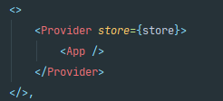

# LinkedIn-Clone (Redux & Firebase)

### 검색해 볼것들
- justify-content: space-evenly;
-  height: fit-content;
- '@reduxjs/toolkit';
### 꿀 TIP!
- flex 1 활용법   

### 리덕스 필수 조건
- 다음과 같이 index.js에 설정해 주어야한다
  

### firebase 배포 하는 방법
- firebase login
- firebase init (hosting-> use an ->build )
- npm run build
- firebase deploy
- The end.

### 데모버전
Project : [Demo](https://linkedin-clone-f97ab.web.app/)  

Thanks to [Sonny Sangha](https://www.youtube.com/watch?v=QaYts9sPmcY&list=WL&index=11) help, This project was able to succeed in making.
